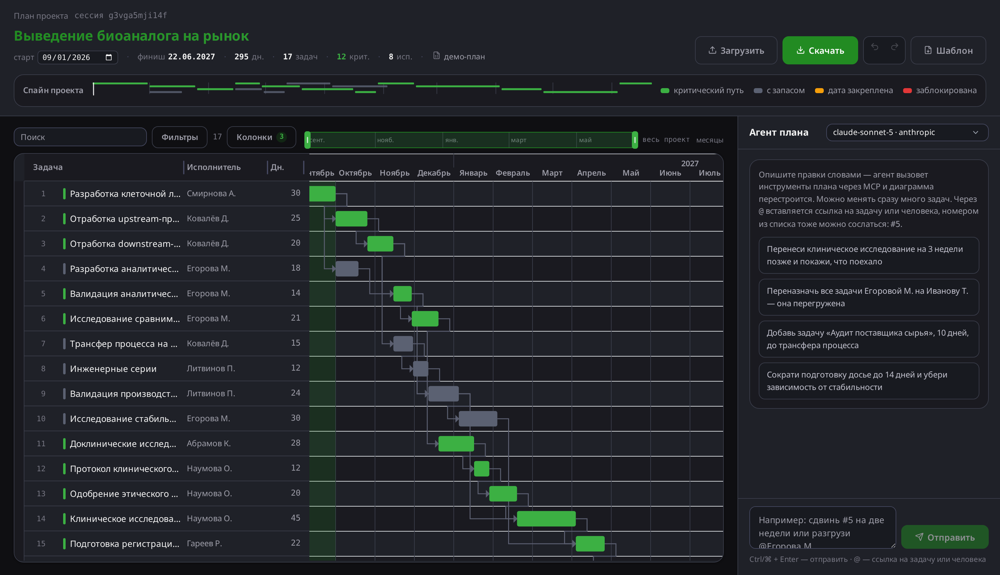

# Диаграмма Ганта с агентом-планировщиком

Веб-приложение: интерактивная диаграмма Ганта с засидированным планом, рядом — чат, через
который план правится на естественном языке. Агент не «советует», а меняет план: он вызывает
инструменты MCP-сервера, каждая правка проверяется теми же правилами, что и правки руками, и
диаграмма перестраивается сразу после хода. План загружается из Excel и выгружается обратно.



Стек: **React** (Vite, TypeScript) + **FastAPI** + **MCP** (официальный Python SDK, stdio) +
**LLM через OpenRouter** (любой OpenAI-совместимый endpoint).

- **Развёрнутое приложение: https://biocad.qzarov.pro**
- Интерфейс собран на дизайн-системе **Frox** (тёмная тема), см. «Оформление» ниже
- Демо сценария «загрузка Excel → правка через чат → экспорт»:
  [`docs/demo.mp4`](docs/demo.mp4) (полный, 60 с) и [`docs/demo.gif`](docs/demo.gif) (ускоренный)
- Пример входного файла: [`samples/example_plan.xlsx`](samples/example_plan.xlsx)
- Шаблон плана (он же демо-план): [`samples/plan_template.xlsx`](samples/plan_template.xlsx)
- Что нужно до продакшена: [`docs/ROADMAP_TO_PRODUCTION.md`](docs/ROADMAP_TO_PRODUCTION.md)

---

## Содержание

- [Быстрый старт](#быстрый-старт) — Docker одной командой или локальный запуск
  - [Docker](#docker-одна-команда) · [Локально](#локально)
- [Деплой](#деплой) — как поднято на VM и как обновлять
- [Как пользоваться](#как-пользоваться) — что где нажимать
- [Формат входного Excel](#формат-входного-excel) — колонки, синонимы, что игнорируется
- [Архитектура](#архитектура) — схема, поток одного хода чата
  - [Инструменты MCP](#инструменты-mcp) — список и подключение внешнего клиента
  - [API](#api) — таблица эндпоинтов
- [Принятые решения](#принятые-решения) — почему сделано так, а не иначе
  - [Тесты](#тесты) — что покрыто и что нет
- [Как использовались AI-ассистенты](#как-использовались-ai-ассистенты)
- [Дальше](#дальше) — ссылка на «Roadmap to production»

---

## Быстрый старт

### Docker (одна команда)

```bash
cp .env.example .env          # и вписать OPENROUTER_API_KEY
docker compose up --build
```

Приложение — на http://localhost:8080 (контейнер слушает loopback; для публикации наружу
без прокси задайте `BIND_HOST=0.0.0.0`). nginx отдаёт статику и проксирует `/api` на бэкенд
(тот же origin, поэтому CORS в продовой сборке не нужен). План хранится в томе `plan-data`.

### Локально

Бэкенд (Python 3.11+):

```bash
cd backend
python -m venv .venv && ./.venv/bin/pip install -r requirements-dev.txt
cp .env.example .env          # и вписать OPENROUTER_API_KEY
./.venv/bin/uvicorn app.main:app --reload --port 8000
```

Фронтенд (Node 20+):

```bash
cd frontend
npm install
npm run dev                   # http://localhost:5173, /api проксируется на :8000
```

Без ключа LLM приложение работает: диаграмма, модалка, drag, импорт/экспорт, откат — всё
доступно, отключён только чат (об этом честно написано в интерфейсе).

Тесты бэкенда:

```bash
cd backend && ./.venv/bin/python -m pytest       # 61 тест, ~3 c
```

---

## Деплой

Развёрнуто на собственной VM (Ubuntu 22.04) в `/var/www/biocad-gantt`:
`docker compose` поднимает два контейнера, порт публикуется **только на loopback**
(`127.0.0.1:8085`), наружу отдаёт системный nginx на домене `biocad.qzarov.pro` с сертификатом
Let's Encrypt (certbot, автопродление). В прокси-локации `/api/chat` буферизация выключена —
иначе события хода агента доходили бы до браузера пачкой в самом конце.

Требуется **Docker Compose v2**: legacy `docker-compose` 1.29 несовместим с Docker 29
(падает при пересоздании контейнеров с томами). Плагин ставится одним файлом:

```bash
curl -sSL https://github.com/docker/compose/releases/download/v2.32.4/docker-compose-linux-x86_64 \
  -o /usr/libexec/docker/cli-plugins/docker-compose && chmod +x /usr/libexec/docker/cli-plugins/docker-compose
```

Обновление на сервере:

```bash
cd /var/www/biocad-gantt && git pull && docker compose up -d --build
```

Ключ LLM живёт в `/var/www/biocad-gantt/.env` (права 600, в репозиторий не попадает).

---

## Как пользоваться

| Действие | Как |
| --- | --- |
| Посмотреть план | Открыть страницу — демо-план уже загружен |
| Детали задачи | Двойной клик по строке или полоске |
| Сменить исполнителя | В модалке поле «Исполнитель» подсказывает тех, кто уже есть в плане; нового можно напечатать |
| Поставить статус | В модалке «Статус»: не начата / в работе / готова / заблокирована; статус виден отдельной колонкой и фильтруется |
| Изменить связи | В модалке «Связи» — два списка с поиском: «идут до этой задачи» и «зависят от этой» |
| Перенести задачу | Потянуть полоску по таймлайну (или попросить агента) |
| Изменить длительность | Потянуть край полоски / поле в модалке |
| Массовые правки | Чат: «переназначь все задачи Титова С. на Белову Н.» |
| Изменить масштаб и позицию | Шкала над таймлайном: ручки задают окно просмотра (от всего проекта до недели), перетаскивание середины двигает окно, двойной клик — «весь проект», стрелки и Home/End — с клавиатуры |
| Прокрутить таймлайн | Шкала над диаграммой (полосы прокрутки под диаграммой нет — она дублировала шкалу) |
| Отменить / вернуть правку | Стрелки в шапке, Ctrl+Z и Ctrl+Shift+Z |
| Настроить колонки | «Колонки» — исполнитель, дни, начало, окончание, запас, прогресс |
| Изменить ширину колонки | Потянуть границу в шапке списка; двойной клик по границе — вернуть по умолчанию, стрелки — с клавиатуры |
| Поменять задачи местами | Потянуть строку за ручку слева (порядок строк, на даты не влияет) |
| Найти задачи | Поиск по названию/исполнителю/описанию, выбор исполнителя, «только критический путь», «только с фиксацией» |
| Сменить модель | Выпадающий список в шапке чата; действует со следующего запроса |
| Сослаться на задачу или человека | В чате `@` → выпадает список задач (с номерами) и исполнителей, фильтр по тексту или номеру, ↑↓ и Enter — вставить |
| Сослаться номером | Номер строки виден в списке; в чате работает «#5» — инструменты понимают и номер, и название |
| Вернуться к переписке | Переписка хранится на сервере и подгружается после перезагрузки страницы |
| Начать разговор заново | Переписка стирается вместе с планом при импорте нового файла (`POST /api/chat/clear` — в интерфейсе кнопки нет) |
| Загрузить свой план | «Загрузить Excel» |
| Выгрузить план | «Скачать Excel» |

| Начать со шаблона | «Скачать шаблон плана» — тот же план, что открывается по умолчанию; заполните и загрузите обратно |

Что понимает агент (проверенные формулировки):

- «Перенеси квалификацию PQ на две недели позже» — сдвиг с фиксацией даты;
- «Переназначь все задачи Егоровой М. на Иванову Т.» — массовая замена исполнителя;
- «Добавь задачу „Аудит поставщика“ на 10 дней перед поставкой» — новая задача с зависимостью;
- «Убери зависимость досье от стабильности» — правка графа;
- «Сократи подготовку досье до 14 дней» — длительность;
- «Сдвинь старт проекта на 1 ноября» — пересчёт всего плана.

В шапке рядом с фактами о плане видно, из какого файла он загружен (или «демо-план»), и число
замечаний планировщика, если они есть.

Цвета на диаграмме: **фирменный зелёный** — критический путь (то, что определяет срок),
**серо-синий** — задача с запасом, **янтарный** — дата закреплена вручную, **бирюзовый** —
задача, которую только что изменил агент, **красный** — заблокированная задача (единственное
место, где красный на диаграмме уместен: это сигнал проблемы, и он же перебивает остальные цвета
на спайне). Полоска в шапке («спайн проекта») показывает всю длительность
сразу: где плотность работ и где идёт критический путь.

---

## Формат входного Excel

Обязательные по ТЗ колонки: `задача`, `описание`, `исполнитель`, `длительность`,
`предшественники`. Плюс необязательный `статус` — принимает и код (`in_progress`), и подпись
(«в работе»). Импорт намеренно терпимый:

- заголовки распознаются по русским и английским синонимам, в любом порядке;
- лишние колонки игнорируются, пустые строки пропускаются;
- предшественники — через запятую или точку с запятой, по названию задачи **или** по id;
- ошибки собираются по всему файлу и возвращаются списком с номерами строк, а не по одной.

Экспорт пишет те же пять колонок плюс `id`, `зафиксировать с`, `начало`, `окончание`, `статус`,
`критический путь`, `запас, дн`, `прогресс, %` и лист «Метаданные» с названием и стартом
проекта. Вычисленные даты при повторном импорте игнорируются — они производные, а не входные.
Файл, выгруженный из приложения, импортируется обратно без потерь (это покрыто тестом).

Даты в плане нигде не хранятся: Excel даёт длительности и зависимости, а даты считает
планировщик. Единственная дата, которую можно задать вручную, — «не раньше» (фиксация).

---

## Архитектура

```
┌──────────────────────────── браузер ─────────────────────────────┐
│  React 18 + Vite                                                 │
│  ├── GanttBoard (gantt-task-react): полоски, стрелки, drag       │
│  ├── ChatPanel: SSE-поток, чипы вызовов инструментов             │
│  ├── TaskModal: детали + правка                                  │
│  └── ProjectSpine: сводная шкала проекта                         │
└───────────────┬────────────────────────────┬─────────────────────┘
                │ REST (план, Excel)         │ POST /api/chat (SSE)
┌───────────────▼────────────────────────────▼─────────────────────┐
│  FastAPI                                                         │
│  ├── main.py      маршруты, SSE                                  │
│  ├── ops.py       ВСЕ правила правок (единственная реализация)   │
│  ├── scheduler.py CPM: даты, критический путь, запас             │
│  ├── excel_io.py  импорт/экспорт xlsx                            │
│  ├── store.py     SQLite: снимки плана + undo                    │
│  └── agent/       LLM-клиент + MCP-клиент + цикл tool-calling    │
└───────────────┬──────────────────────────────────────────────────┘
                │ stdio (MCP), процесс на ход чата
┌───────────────▼──────────────────────────────────────────────────┐
│  MCP-сервер (app/mcp_server): 13 инструментов над планом         │
│  читает и пишет тот же SQLite-файл                               │
└──────────────────────────────────────────────────────────────────┘
```

Поток одного хода чата:

1. `POST /api/chat` открывает SSE-ответ и запускает `run_turn`.
2. Поднимается MCP-сервер (дочерний процесс, stdio), у него запрашивается список инструментов.
3. Схемы инструментов конвертируются в формат `tools` OpenAI-совместимого API и уходят в LLM
   вместе с системным промптом, в который уже вложен текущий план (агенту не нужен лишний
   round-trip только чтобы узнать id задач).
4. Модель отдаёт tool_calls → каждый вызов идёт в MCP → `ops` проверяет и сохраняет снимок.
   Каждый шаг летит в браузер событием `tool_call` / `tool_result`, поэтому чат показывает
   работу по мере выполнения, а не «думаю…» на 20 секунд.
5. В конце — событие `plan` с пересчитанным расписанием и списком изменённых задач; диаграмма
   перерисовывается и подсвечивает то, что поехало.

### Инструменты MCP

`get_plan`, `list_assignees`, `add_task`, `update_task`, `delete_task`, `set_predecessors`,
`set_successors`, `shift_task`, `move_task_to`, `unpin_task`, `reassign_tasks`, `reorder_task`,
`set_project_start`.

Сервер — обычный stdio MCP-сервер, его можно подключить к любому MCP-клиенту (Claude Desktop,
Cursor, Claude Code) и править тот же план оттуда:

```json
{
  "mcpServers": {
    "project-plan": {
      "command": "/абсолютный/путь/backend/.venv/bin/python",
      "args": ["-m", "app.mcp_server"],
      "cwd": "/абсолютный/путь/backend",
      "env": { "PLAN_SESSION_ID": "default", "PLAN_DB_PATH": "data/plans.sqlite3" }
    }
  }
}
```

### API

| Метод | Путь | Назначение |
| --- | --- | --- |
| GET | `/api/health` | статус, настроен ли LLM, модель |
| GET | `/api/plan` | план + расписание + история |
| POST | `/api/plan/import` | загрузка .xlsx (multipart) |
| GET | `/api/plan/export` | выгрузка .xlsx |
| GET | `/api/plan/template` | шаблон плана (демо-план) в .xlsx |
| POST | `/api/plan/undo` | откат на один снимок |
| POST | `/api/plan/redo` | вернуть отменённый снимок |
| POST | `/api/plan/reset` | вернуть демо-план (в интерфейсе не выведено) |
| POST | `/api/plan/tasks` | добавить задачу |
| PATCH | `/api/plan/tasks/{id}` | правка задачи, drag, фиксация даты |
| POST | `/api/plan/tasks/{id}/reorder` | переставить строку до/после другой задачи |
| DELETE | `/api/plan/tasks/{id}` | удалить задачу |
| POST | `/api/plan/project-start` | сдвинуть старт проекта |
| GET | `/api/models` | модели, доступные в выпадающем списке чата |
| POST | `/api/chat` | ход агента, поток SSE (поле `model` — необязательное) |
| POST | `/api/chat/clear` | очистить историю диалога |

Сессии разделяются по `session_id` (фронтенд держит его в localStorage и передаёт заголовком
`X-Session-Id`), поэтому два человека в одном инстансе не мешают друг другу.

---

## Принятые решения

**Даты — производные, а не поле.** Входной формат даёт длительности и зависимости, значит
единственный честный источник дат — планировщик. CPM считает ранние даты, обратным проходом —
запас и критический путь. Ручная дата задаётся отдельным полем-фиксацией «не раньше», и
зависимости всегда сильнее фиксации: агент не может двинуть задачу вперёд своих
предшественников, он получит объяснение вместо результата.

**Календарные дни, не рабочие.** Сознательное упрощение: без производственного календаря,
праздников и загрузки исполнителей. Это первое, что нужно доработать для боевого применения
(см. roadmap), но оно не влияет на архитектуру: правило живёт в одном модуле.

**Все правки — через `ops.py`.** И REST от интерфейса, и MCP-инструменты агента вызывают одни
и те же функции. Поэтому drag-and-drop не может создать состояние, которое агенту запретили
бы, а сообщения об ошибках («получается цикл», «задача не найдена, вот список») одинаковы в
чате и в интерфейсе. Каждая функция чистая: принимает план, возвращает новый.

**MCP как настоящий процесс, а не обёртка.** Сервер запускается отдельным процессом по stdio, и
поэтому состояние нельзя держать в памяти — оно в SQLite, к которому обращаются оба процесса.
Побочная выгода: тот же сервер подключается к внешним MCP-клиентам, а история снимков даёт undo.
Процесс поднимается на каждый ход чата (~0.3 c) — просто и без утечек; пул вынесен в roadmap.

**Стрим событий, а не токенов.** Вызовы LLM неструктурированно не стримятся: показывать
по-токенно текст, который в 90% случаев состоит из tool_calls, бессмысленно. Вместо этого
стримятся события хода — какой инструмент вызван и что он ответил. Пользователь видит работу,
а не спиннер.

**План в системном промпте.** Компактная выжимка плана (id, название, исполнитель, дни, даты,
предшественники) вкладывается в системное сообщение каждого хода. Экономит один tool-call и
резко снижает число попаданий «задача не найдена».

**Выбор модели — по белому списку.** Список задаётся переменной `LLM_MODELS`, поэтому набор
меняется без правок кода, а поле `model` из браузера проверяется на сервере: иначе оно стало бы
способом гонять любые, в том числе дорогие, модели за наш ключ. Проверены на живых ходах
Claude Sonnet 5, Claude Opus 5, GPT-5.6 Terra, Gemini 3.7 Flash, DeepSeek v3.1 и Qwen3 Max —
все корректно вызывают MCP-инструменты.

**Фильтр не влияет на расчёт.** Планировщик всегда считает весь план, фильтр только решает,
какие строки показать. Иначе скрытая задача выпала бы из расчёта дат и диаграмма врала бы;
из-за этого же при активном фильтре пропадают стрелки к скрытым задачам — сознательный
компромисс, о нём говорит счётчик «показано N из M».

**Масштаб и навигация — одна величина, а не три контрола.** Шкала над таймлайном задаёт окно
просмотра в днях от старта проекта; из него выводятся и шаг таймлайна (дни / недели / месяцы), и
ширина колонки, и позиция прокрутки. Человек думает «покажи мне вот этот кусок проекта», а не
«поставь колонку 74px и прокрути на 1300px», поэтому отдельные табы шага и ползунок масштаба
убраны.

Перевод дней в пиксели пришлось делать точным, а не «долей от прокрутки»: `gantt-task-react`
дорисовывает после конца проекта целый год при месячном шаге, полтора месяца при недельном и 19
дней при дневном (замерено), плюс одну колонку перед стартом. Доля от общей прокрутки поэтому
уводила окно в пустое будущее; сейчас смещение считается через `leadDays()` и число дней на
колонку. Проверено сценарием: при «всём проекте» видны все полоски, при окне в конце — только
последние три.

**На телефоне диаграмма остаётся рабочей.** Список в полную ширину выдавливал таймлайн за край
экрана, и двигать диаграмму было нечем: колеса на тач-устройствах нет, а полосу прокрутки мы
убрали. Поэтому на узких экранах в списке остаётся только колонка с названием (настройки колонок
при этом не теряются), подписи кнопок сворачиваются в иконки, у спайна прячется легенда, а
таймлайн двигается перетаскиванием пустого поля — жест работает и мышью, и пальцем. Вертикальный
жест по-прежнему прокручивает список: ось определяется по первым шести пикселям движения.

**Ничего лишнего по краям.** Подвал со строкой состояния убран: модель видна в шапке чата рядом с
названием, историю показывают стрелки отмены и возврата, а имя файла-источника и замечания
планировщика переехали в шапку к остальным фактам о плане. Имя файла живёт в самом плане
(`Plan.source`), поэтому переживает правки, откат и экспорт.

**Одна ручка на одно действие.** Горизонтальная полоса прокрутки под диаграммой убрана: после
появления шкалы она делала то же самое и отнимала высоту. Сам элемент библиотеки остался в потоке
и невидим — из него берутся ширина видимой области и геометрия таймлайна.

**Уведомления не двигают раскладку.** Сообщения об изменениях всплывают в правом верхнем углу и
живут 3 секунды; ошибки — дольше и с крестиком, потому что в них бывает список проблем по строкам
файла. Раньше это была строка над диаграммой, из-за которой содержимое прыгало.

**Контролы стоят над тем, чем управляют.** Поиск, фильтры и колонки — над списком задач (ширина
зоны равна ширине списка), шкала — над таймлайном. Второстепенные условия фильтра убраны в меню
со счётчиком включённых, статистика проекта сжата в одну строку: экран нужен диаграмме, а не
настройкам.

**Отмена и возврат — стрелками.** Обе кнопки ходят по той же истории снимков, что и правки
агента, и работают на Ctrl+Z / Ctrl+Shift+Z (в полях ввода — не перехватываются). Новая правка
после отмены обрезает «будущее», как в любом редакторе; это зафиксировано тестом.

**Настройки вида — в браузере.** Набор колонок, их ширины, масштаб и выбранная модель лежат в
localStorage: это предпочтения одного человека, а не часть плана, и синхронизировать их между
устройствами незачем. Во время перетаскивания границы ширина живёт в состоянии диаграммы и
уходит в настройки один раз, на отпускании — иначе каждое движение мыши писало бы в localStorage.

**Статус и прогресс не должны противоречить друг другу.** «Готова» с прогрессом 40% — данные,
которым никто не поверит, поэтому `update_task` держит их согласованными: статус «готова» без
явного прогресса ставит 100%, «не начата» — 0%, а прогресс 100% сам переводит задачу в «готова»
(кроме заблокированных). Явно переданное значение всегда сильнее выведенного, так что странные
сочетания всё-таки можно записать осознанно. На расчёт дат статус не влияет — планировщик
считает по длительностям и зависимостям.

**Связи правятся с обеих сторон.** Технически связь хранится у зависимой задачи
(`predecessors`), но думать удобно и «после кого идёт эта», и «кто идёт после неё». Поэтому в
модалке два списка, а на бэкенде появился `set_successors`, который раскладывает второй список
по предшественникам других задач. Взаимоисключающие чекбоксы блокируются в интерфейсе, циклы
всё равно отклоняет сервер — правило одно и то же для человека и для агента.

**Исполнитель выбирается из тех, кто уже есть.** Свободный ввод остался (людей в плане никто
заранее не регистрирует), но список-подсказка убирает опечатки, из-за которых один человек
превращается в двух.

**Порядок строк — представление, а не данные.** Перетаскивание строк меняет только порядок в
списке (он же порядок строк Excel) и не влияет на расчёт: даты задают длительности и зависимости.
На сервер уходит не номер строки, а «поставить до/после такой-то задачи» — иначе при включённом
фильтре номер видимой строки не совпадал бы с номером в плане. Это же правило проверено тестом:
после переупорядочивания все даты обязаны совпасть.

**Ограничитель шагов.** Один ход — не больше `MAX_TOOL_STEPS` (по умолчанию 10) обращений к
модели, дальше честное сообщение вместо бесконечного цикла.

**Оформление — дизайн-система Frox, тёмная тема.** Токены (`frontend/src/styles/frox-tokens.css`)
и примитивы (`frontend/src/styles/frox.css`) скопированы из канонического источника — админки
wf-panel — без изменения значений: продукт должен выглядеть как остальные панели, а не «примерно
как они». Своих hex-значений в оформлении почти нет, всё идёт через токены, поэтому светлая тема
включается одним атрибутом `data-theme="light"` на `<html>`. Кнопки, поля, табы, чекбоксы и
пустые состояния — готовые классы `frox-*`; собственные стили описывают только раскладку и то,
чего в системе нет (диаграмма, чат, спайн проекта).

Два места пришлось перебить на уровне приложения, и оба помечены комментариями: в каноническом
`frox.css` селектор `.dark .frox-btn-outline` перебивает `.frox-btn-danger`, из-за чего в тёмной
теме опасная кнопка теряет красный; и `a.frox-btn` остаётся подчёркнутым, потому что сброса
`text-decoration` в системе нет.

**Смысловые цвета плана.** Критический путь несёт фирменный зелёный: это главное содержание
плана, а не авария. Задачи с запасом уходят в нейтральный серо-синий, ручная фиксация даты — в
янтарный, свежие правки агента — в бирюзовый. Красный остаётся исключительно за ошибками
(отклонённая правка, сбой инструмента), иначе нормальный план с двенадцатью критическими
задачами выглядит как сплошная авария.

**Готовая библиотека для диаграммы.** `gantt-task-react`: стрелки зависимостей, drag, режимы
день/неделя/месяц из коробки. Списочная часть, тултип и шапка заменены своими компонентами,
чтобы диаграмма жила в общей типографике и палитре. Библиотека требует React 18 — версии
зафиксированы. Она нарисована под светлую тему прямо в SVG, поэтому сетка, календарь и подложка
перекрашиваются токенами (группы `calendar`, `rows`, `ticks`, `today` имеют стабильные имена
классов), а дублирующие подписи у полосок скрыты — слева уже есть колонка с названиями.

**Переписка — в том же SQLite, что и план.** История чата не теряется при перезагрузке страницы
и при рестарте бэкенда. Хранятся ровно те сообщения, которые уходят в модель, а транскрипт для
интерфейса собирается из них же (`transcript()` в `agent/loop.py`): два хранилища со временем
разъехались бы. В контекст модели уходит последние `HISTORY_LIMIT` сообщений, показывается вся
переписка — окно контекста и деньги ограничивают модель, а не читателя.

**Номер задачи — это позиция в списке.** Тот же номер видно в интерфейсе, он уходит в промпт
и в `get_plan`, и `resolve_task` понимает «#5». Но номер меняется при переупорядочивании, а
текст уже отправленного (или ещё набираемого) сообщения — нет. Поэтому через `@` в текст
вставляется **название** в кавычках, а не номер: такая ссылка не портится от перетаскивания
задач. Номер остаётся тем, для чего он хорош — искать в меню и сослаться вручную «#5», причём
разбирается он в момент отправки, по актуальному плану.

Три страховки на случай, когда номер всё же устарел: `resolve_task` снимает кавычки вокруг
ссылки, при противоречивой ссылке вида «#4 «Разработка методик»» верит названию, а не номеру, и
системный промпт велит агенту в таком случае работать по названию и сказать об этом, а не
переспрашивать.

**Длинные ответы в чате свёрнуты до четырёх строк.** Кнопка «Развернуть» появляется только если
текст действительно не уместился: высота измеряется после отрисовки, потому что при переносах и
разной ширине панели «сколько строк» по символам не угадать.

**Ошибки — текстом, который можно прочитать.** Импорт возвращает номера строк, MCP-инструменты —
строку, начинающуюся с «ОШИБКА», и агент по ней исправляется сам (это проверено тестом). Ошибки
LLM разворачиваются из `ExceptionGroup` анио-таскгруппы, иначе пользователь видел бы
«unhandled errors in a TaskGroup» вместо «ключ отклонён».

### Тесты

61 тест pytest, ~3 секунды, без сети:

- `test_scheduler.py` — даты, параллельные ветки, критический путь, запас, фиксации, циклы;
- `test_excel_io.py` — синонимы заголовков, ошибки по строкам, round-trip, стабильность id;
- `test_ops.py` — правила правок, разрешение ссылок на задачи, чистота функций;
- `test_mcp_server.py` — реальный запуск MCP-сервера по stdio: хендшейк, схемы, правки, ошибки;
- `test_api.py` — REST, импорт/экспорт, undo, и полный ход чата с фейковой моделью
  (SSE → цикл агента → MCP-процесс → SQLite).

Не покрыто автотестами: собственно HTTP-вызов OpenRouter (в тестах модель подменяется
фейком, чтобы прогон не зависел от сети и ключа) и вёрстка.

---

## Как использовались AI-ассистенты

Проект целиком написан в паре с **Claude Code (Opus)** — это был не автокомплит, а рабочий
процесс из нескольких ролей.

**Дизайн до кода.** Сначала прогнал ТЗ через обсуждение архитектуры: где живут правила, почему
MCP-сервер должен быть отдельным процессом, что делать с датами, которых нет во входном файле.
Развилки, которые нельзя решить за заказчика (провайдер LLM, площадка деплоя, своя или готовая
диаграмма), я вынес вопросами и зафиксировал ответы до начала кодирования.

**TDD там, где это ядро.** Планировщик, Excel-слой и слой операций писались тестами вперёд:
сначала таблица ожиданий (в том числе на циклы и на фиксацию раньше зависимостей), потом
реализация. Два настоящих баги нашлись именно так и не дожили до демо:

1. Ошибка LLM приходила завёрнутой в `ExceptionGroup` от anyio-таскгруппы MCP-клиента, и
   пользователь видел «unhandled errors in a TaskGroup» вместо причины.
2. Имя задачи с запятой («Клиническое исследование, фаза I») ломало обратный импорт: запятая
   совпала с разделителем списка предшественников. Починено колонкой `id` в экспорте и
   правилом «имя с разделителем пишем как id».

**Проверка руками, а не «по ощущениям».** UI прогонялся headless-браузером: импорт файла,
модалка, правка длительности, откат — со снятием скриншотов и чтением консоли на ошибки.
Docker-образы собирались и запускались, чат дёргался curl'ом, чтобы убедиться, что MCP-процесс
поднимается внутри контейнера (в логах виден `ListToolsRequest`).

**Дизайн интерфейса — отдельным проходом.** Первая версия была самостоятельной («лабораторная
панель» на IBM Plex), но по требованию заказчика интерфейс переведён на корпоративную
дизайн-систему Frox в тёмной теме. Токены и примитивы взяты из канонического источника, а не
воспроизведены по памяти — так продукт остаётся единым с остальными панелями. Единственный
намеренно нестандартный элемент, «спайн проекта» в шапке, сохранён и перекрашен токенами.

**Где ассистент был бесполезен или мешал.** Первое предложение по стилю диаграммы было
типовым «дашбордом» — пришлось задавать направление вручную. Библиотека `gantt-task-react`
не даёт хука на класс полоски, поэтому подсветку изменённых задач пришлось делать через цвет
полоски и класс строки в своей таблице — это ограничение библиотеки, а не выбор. При переводе
на Frox первая попытка раскрасила критический путь красным (danger) — формально «по палитре»,
а по факту нормальный план выглядел как сплошная авария; семантику пришлось пересмотреть,
глядя на скриншот.

---

## Дальше

[`docs/ROADMAP_TO_PRODUCTION.md`](docs/ROADMAP_TO_PRODUCTION.md) — что осталось техдолгом
сознательно, чего не хватает для боевого состояния, риски и порядок закрытия.
